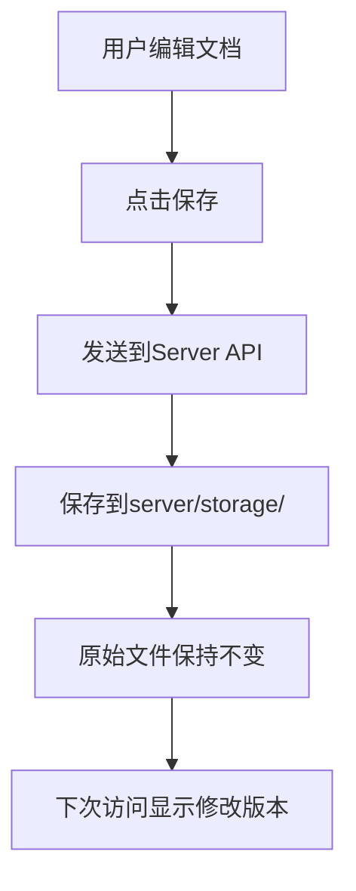

# 📚 Version Management System

## 🎯 新的文档管理方案

我们实现了一个智能的文档版本管理系统，让你可以安全地编辑文档，同时保护原始文件。

## 🔄 工作流程

### 📖 文档加载优先级

当你访问任何处理器的文档时，系统按以下顺序加载内容：

1. **🔍 Server存储版本** (最高优先级)
   - 位置: `server/storage/docs/{type}/{id}.md`
   - 这是你的修改版本
   - 如果存在，优先显示

2. **💾 LocalStorage草稿** (中等优先级)
   - 浏览器本地存储
   - 24小时内的草稿
   - 作为fallback

3. **📄 原始文件** (最低优先级)
   - 位置: `sample/public/docs/processors/{type}/{id}.md`
   - 项目原始文档
   - 永远不会被修改

### ✏️ 编辑和保存流程



## 🛡️ 安全特性

### ✅ 原始文件保护
- **原始文件永远不会被覆盖**
- 所有修改都保存在独立的server存储中
- 可以随时恢复到原始版本

### 🔄 版本管理
- **Original Version**: 项目原始文档
- **Modified Version**: 你的编辑版本
- **Metadata**: 包含修改时间、版本信息等

### 📁 文件结构

```
project/
├── sample/public/docs/processors/     # 原始文件 (只读)
│   ├── video/
│   │   ├── processor1.md
│   │   └── processor2.md
│   └── audio/
│       └── processor3.md
└── server/storage/docs/               # 修改版本 (可写)
    ├── video/
    │   ├── processor1.md              # 你的修改版本
    │   ├── processor1.meta.json       # 元数据
    │   └── processor2.md
    └── audio/
        └── processor3.md
```

## 🎮 使用方法

### 1. 编辑文档
- 进入任意处理器页面
- 点击 **"Edit Documentation"** 标签
- 在编辑器中修改内容
- 点击 **Save** 保存

### 2. 查看版本状态
- 页面顶部会显示当前文档版本
- **📝 Modified**: 显示你的修改版本
- **📄 Original**: 显示原始版本

### 3. 重置到原始版本
- 如果显示 "Modified" 版本
- 点击 **"Reset to Original"** 按钮
- 确认后会删除修改版本，回到原始文档

## 🔧 API 端点

### 保存修改版本
```http
POST /api/docs/save
{
  "processorType": "video",
  "processorId": "processor-name",
  "content": "markdown content"
}
```

### 加载文档 (自动选择版本)
```http
GET /api/docs/load/video/processor-name
```

### 重置到原始版本
```http
POST /api/docs/reset/video/processor-name
```

### 查看版本信息
```http
GET /api/docs/versions/video/processor-name
```

### 列出所有文档
```http
GET /api/docs/list
```

## 💡 优势对比

| 特性 | 旧方案 | 新方案 |
|------|--------|--------|
| 原始文件安全 | ❌ 直接覆盖 | ✅ 完全保护 |
| 版本管理 | ❌ 无版本控制 | ✅ 双版本系统 |
| 回滚能力 | ❌ 无法回滚 | ✅ 一键重置 |
| 协作友好 | ❌ 冲突风险 | ✅ 独立修改 |
| 数据安全 | ❌ 意外丢失 | ✅ 多重备份 |

## 🚀 使用场景

### 📝 内容创作者
- 可以自由编辑文档而不担心破坏原始内容
- 支持多次修改和实验
- 随时可以重置到干净状态

### 👥 团队协作
- 每个人可以有自己的修改版本
- 不会互相覆盖
- 便于讨论和比较

### 🔧 开发者
- 原始文档在Git中保持干净
- 修改版本可以独立管理
- 支持渐进式文档改进

## 🎯 最佳实践

1. **定期备份**: 重要修改建议下载备份
2. **版本标记**: 在修改时添加版本说明
3. **团队沟通**: 修改前与团队成员沟通
4. **测试验证**: 修改后检查渲染效果
5. **及时保存**: 利用自动保存功能

## 🔮 未来扩展

- **Git集成**: 自动提交修改版本
- **协作编辑**: 实时多人编辑
- **版本历史**: 保留多个历史版本
- **内容审核**: 修改审批流程
- **模板系统**: 文档模板管理

---

**当前状态**: ✅ 版本管理系统已实现  
**使用建议**: 放心编辑，原始文件完全安全！ 