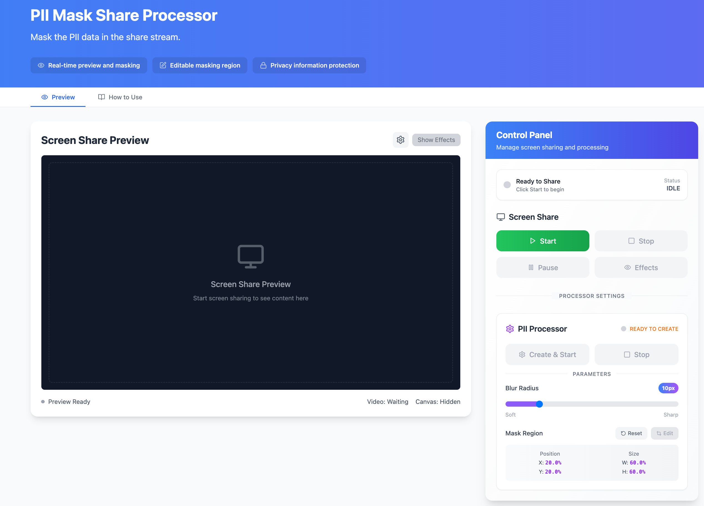
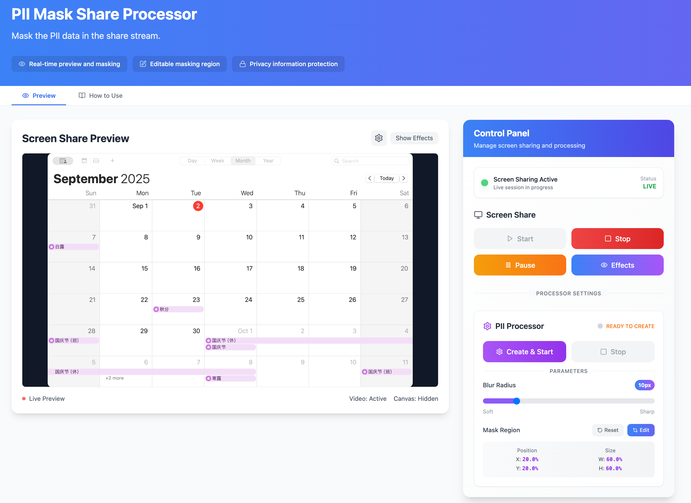
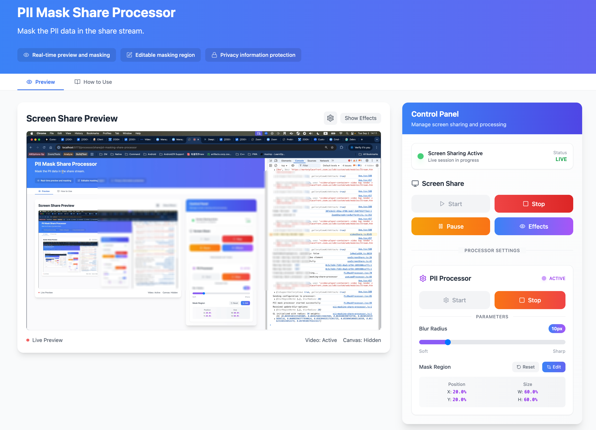
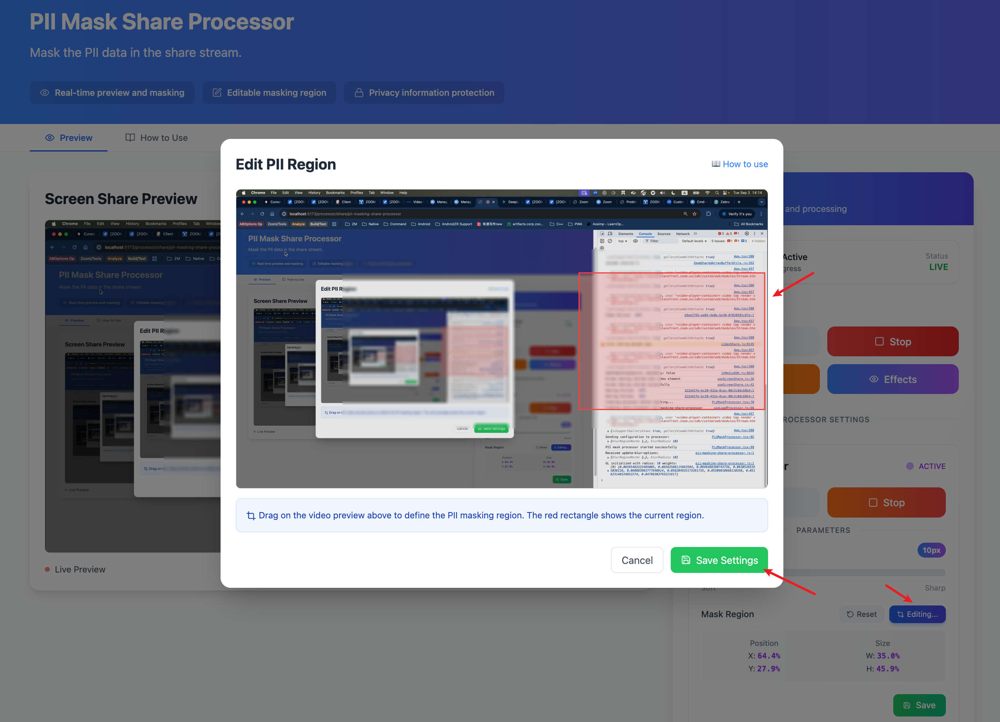

# PII Masking Share Processor

## Overview

The **PII Masking Share Processor** is a WebGL2-based processor that applies blur effect to specified regions of shared screen content in real-time. This processor is designed to protect Personally Identifiable Information (PII) during screen sharing sessions by selectively blurring sensitive areas.

## Technical Specifications

### Processor Type

- **Type**: Share Processor
- **Target**: Screen sharing streams
- **Rendering**: WebGL2 fragment shaders

### Browser Support

- **ScreenShare Required**: Only desktop browsers support
- **WebGL2 Required**: Modern browsers with WebGL2 support
- **API Required**: VideoFrame and OffscreenCanvas support

## Usage

### Try It Out!

The example page contains two sections: the left side displays the screen share stream or the stream processed by the processor. The right side features a control panel for starting and ending screen sharing, as well as adjusting processor parameters in real time to observe the effects.

{width=600px}

On the control panel, first click the Start button for screen sharing to initiate it. You can view the screen share content in the preview area. At this point, the share processor has not yet started; next, we will launch the share processor. You may also click Stop to terminate the screen share.

{width=600px}

On the PII Processor control panel, click Create & Start to launch the share processor. The preview area will display the stream processed by the share processor. In the central screen share area, you'll notice a rectangular region blurred to indicate this is a PII area requiring processing. Simultaneously, in the right-hand control panel area, you can dynamically select specific regions for privacy blurring. Adjusting the `blurRadius` dynamically alters the intensity of the blur effect.

{width=600px}
{width=600px}

### Basic Integration

```javascript
// 1. Create the processor
const processor = await mediaStream.createProcessor({
  url: "/pii-masking-share-processor.js",
  type: "share",
  name: "pii-masking-share-processor",
  options: {
    blurRegionNorm: {
      x: 0.2, // Left position (0-1, normalized)
      y: 0.2, // Top position (0-1, normalized)
      width: 0.6, // Width (0-1, normalized)
      height: 0.6, // Height (0-1, normalized)
    },
    blurRadius: 10, // Blur intensity (pixels)
  },
});

// 2. Add processor to media stream (async)
await mediaStream.addProcessor(processor);

// 3. Update blur settings
processor.port.postMessage({
  command: "update-blur-options",
  blurRegionNorm: {
    x: 0.1,
    y: 0.1,
    width: 0.8,
    height: 0.8,
  },
  blurRadius: 15,
});

// 4. Remove processor when done (async)
await mediaStream.removeProcessor(processor);
```

## Configuration Options

### Initialization Options

| Property         | Type   | Default                                     | Description                            |
| ---------------- | ------ | ------------------------------------------- | -------------------------------------- |
| `blurRegionNorm` | Object | `{x: 0.2, y: 0.2, width: 0.6, height: 0.6}` | Normalized coordinates for blur region |
| `blurRadius`     | Number | `10`                                        | Blur intensity in pixels               |

### Blur Region Properties

| Property | Type   | Range     | Description                |
| -------- | ------ | --------- | -------------------------- |
| `x`      | Number | 0.0 - 1.0 | Left position (normalized) |
| `y`      | Number | 0.0 - 1.0 | Top position (normalized)  |
| `width`  | Number | 0.0 - 1.0 | Region width (normalized)  |
| `height` | Number | 0.0 - 1.0 | Region height (normalized) |

### Runtime Commands

#### Update Blur Options

```javascript
processor.port.postMessage({
  command: "update-blur-options",
  blurRegionNorm: {
    x: 0.1,
    y: 0.1,
    width: 0.8,
    height: 0.8,
  },
  blurRadius: 20,
});
```

## Important Notes:

1. Do not explicitly close the `MessagePort` passed to the constructor within the custom processor. Doing so will prevent you from receiving parameter updates sent by the main thread when restarting the processor multiple times.
2. This example only demonstrates the stream processed by the processor before being sent to other participants during screen sharing. We have not shown what the stream actually looks like when received by participants. This will be added in subsequent updates.
