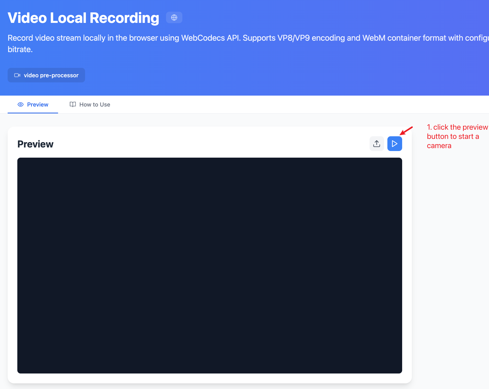
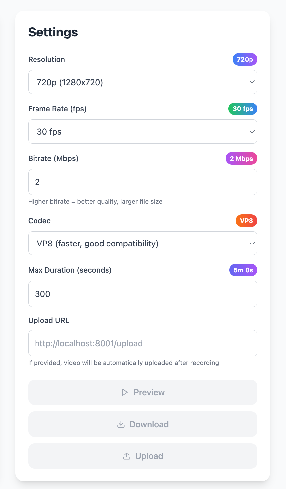
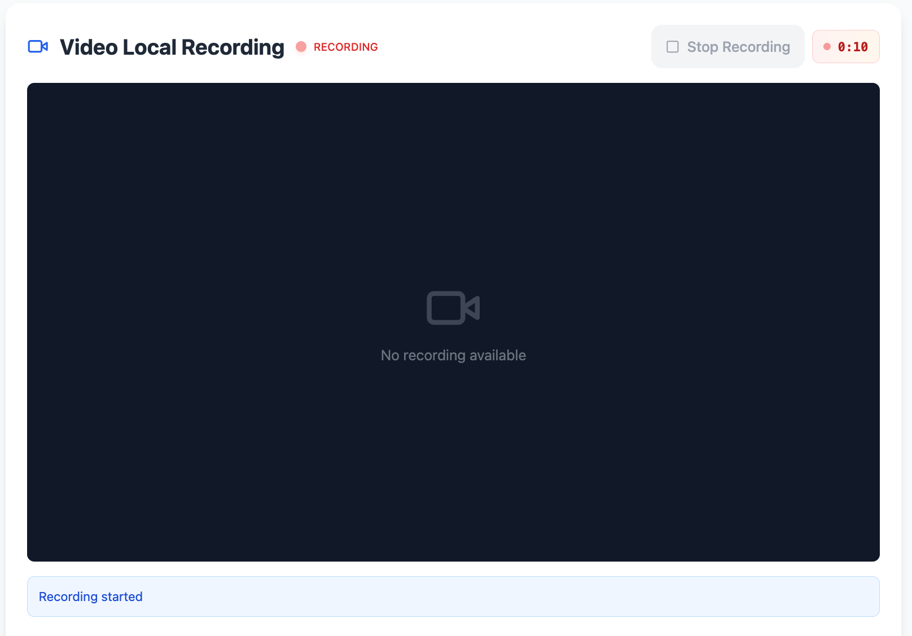
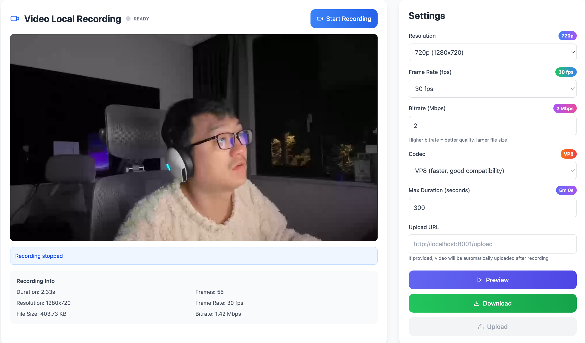
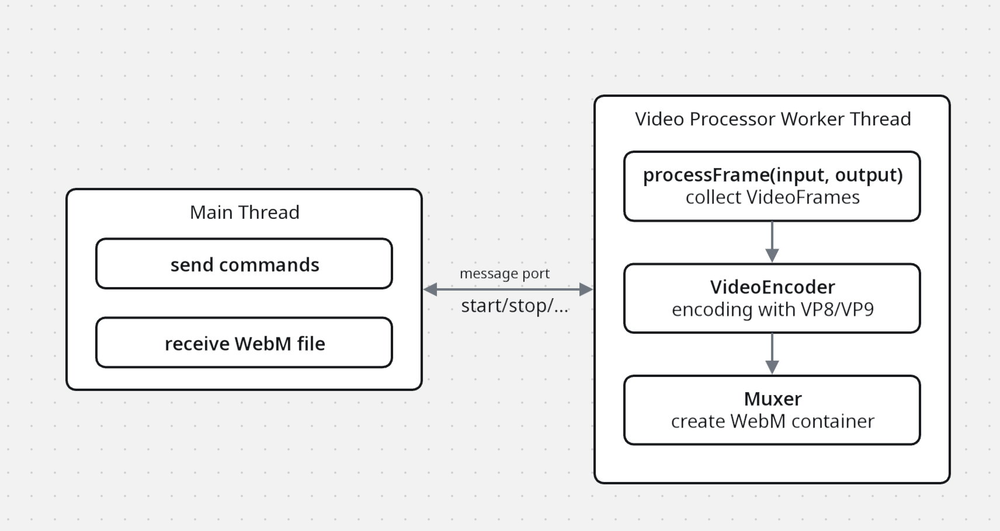

# Video Local Recording Processor

## Overall

Video Local Recording is a video local recording processor based on the WebCodecs API. It enables real-time recording of video streams within the browser and encodes them into WebM format. This processor operates entirely on the client side, requiring no server-side support.

### Features

- ✅ **Real-time video encoding**: Hardware-accelerated encoding using the VideoEncoder API
- ✅ **Multiple encoding formats**: Supports VP8 and VP9 encoders
- ✅ **Configurable parameters**: Fully customizable resolution, frame rate, and bitrate
- ✅ **WebM Container**: Encapsulates as standard WebM files using webm-muxer
- ✅ **Transparent Mode**: Records without disrupting live video display
- ✅ **Memory Optimization**: Queue management prevents memory overflow
- ✅ **Complete Metadata**: Includes detailed information like frame count, duration, bitrate, etc.

## Try It Out!

First, click the camera preview button to start the camera preview.


Before starting the recording, please configure the relevant recording parameters.


Next, click the 'Start Recording' button to start the recording.


Once you want to stop the recording, click the 'Stop Recording' button. After the recording stop, you can see there is an available recording to preview, you can click the Preview button to preview the recording locally. And you click the Download button to download the webm format file to the local storage.


## How It Works?



### VideoFrame Processing

```typescript
async processFrame(input: VideoFrame, output: OffscreenCanvas) {
  const ctx = output.getContext('2d');
  if (ctx) {
    ctx.drawImage(input, 0, 0, output.width, output.height);
  }

  // clone a new VideoFrame, the input will be closed after processFrame call
  if (this.isRecording && this.videoEncoder) {
    const clonedFrame = new VideoFrame(input, {
      timestamp: this.frameCount * (1_000_000 / this.config.framerate),
    });

    const keyFrame = this.frameCount % 30 === 0;
    this.videoEncoder.encode(clonedFrame, { keyFrame });
    clonedFrame.close();
    this.frameCount++;
  }

  return true;
}
```

## Important Notes

1. We use webm-muxer as the container for packaging WebM files. By default, it supports both VP8 and VP9 encoders. If you wish to use an H.264 encoder, we cannot use webm-muxer.
